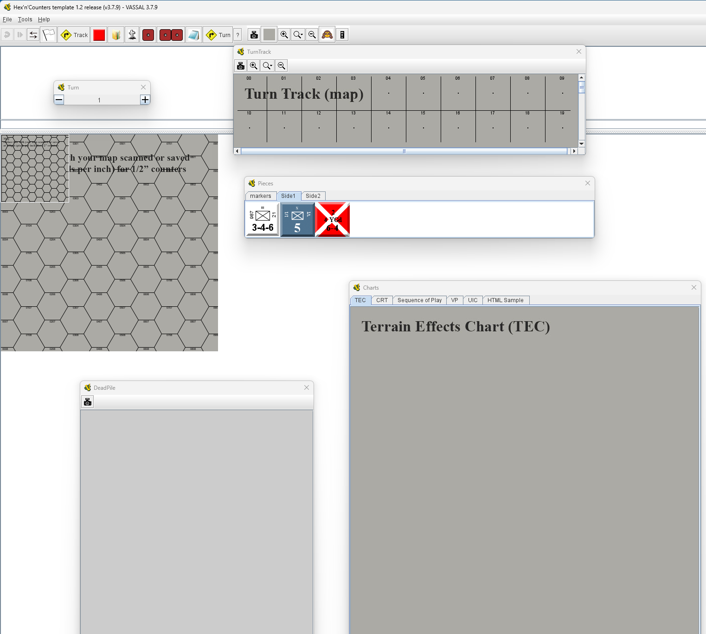

# Hex n Counters Template v12

## Help Guide

*Note: this is a duplicate of README.md*  
This is a template file for a player help guide. This is intended to be edited to fill in info about your module release.




## Players Guide

If you are new to *Vassal*, visit [vassalengine on the web](www.vassalengine.org) for help.  
*Vassal* is intended to be like playing a real game, so it does not have a computer opponent, you either play solo or against a real opponent. You can play by switching sides 'live' (hotseat) or sending files

## Overview

**[Designer: INSERT OVERVIEW HERE]**

## Startup

Select 'play mode', for a first game select 'Start a new game offline', and Next>
Select the 'Start' setup, Next>
Join as 'observer' to play solo and click Finish.

The game will open with basic counters setup and the map on the screen.
Vassal will ask if you want to open a log file.
The Turn record may also open as a separate window.
Read the rules and any scenario walkthrough (available at https://www.simpubs.org)

## Toolbar

The first 2 buttons are for playing a logfile (back and forward) and are greyed out. Visit the vassal site for more info on logs and saves
The 2 arrows are for network game connections

### FLAG (Sides)

The white flag is to retire, and is also used to switch sides in games with sides active.  
Sides are not enabled for counter control/visibility, but there are two default sides, ```Side1``` and ```Side2```

### TRACK

This opens a window for the turn track.  
**[Designers Note: the track is a map file (map-turntrack.jpg) and has a rectangular grid defined. Note that the turn track and the turn counter are *not* linked, as module builders will have to set the turn track up to their spec.]**

### COUNTER (pieces)

Open the counter window by clicking the red counter icon. This has a set of pieces. Drag pieces to the map according to the deployment rules.  
**[Designers Note: this is a a 25x25px icon called 'icon-pieces.png']**

### FOLDER

The folder icon opens the 'Charts' window, for Sequence of Play (SOP), Combat Results Table (CRT), Terrain Effects Chart (TEC), Unit Identification (UID) and Deployment.  
**[Designers Note: these documents are chart-crt.jpg, -sop, -tec, -uic, -vp]**

### DEADPILE

Eliminated units will go here.  
**[Designers Note: This is a map, just a simple 500x500 gray page]**

### DICE

This icon 'rolls' a 6 sided dice and reports the result. 2d6 are also available. There is a 2d6 also available.

### NOTE

Click this to make and see notes

### TURN

A game turn counter, simple numeric

### ? (Draw Deck)

This is a placeholder for a *Draw Deck*. Refer to the Vassal Designers' Guide for more information.

### CAMERA

Take a screen shot

### MAP (Gray icon)

The map icon (gray in the template - set it by dropping  into the module images folder in a zip tool. This opens (and closes) an overview map. The zoom buttons are self explanatory. if you need help here, give up now and play checkers.  
The monkey icon is hiding ;-) Use this to show/hide units on the map.  

*[Designers Note]* The overview map icon is a 25px high 'icon-map.png'. The map is, unsurprisingly, map.jpg. The map has a generic 1/2" hex grid defined. This will need editing if you add you own map (and the module will not be much use without your own map)

### MOVEMENT

Counters are marked as moved on the map; this icon resets all to remove the MOVED markings

## Playing the Game

Vassal mimics a real game with cardboard pieces. This means that you can make illegal moves, and do stupid, just like I do all the time.  
The game has no computer player/AI, it is what you make it. Just pick up the rules and start a cardboard battle. If you have played wargames it will be very familiar to you

### Pieces

Click the counter icon; it will open a window with a tab of the (very few) counters and markers
There is a Game Turn marker and a generic VP marker with a counter

The 3 NATO pieces, and 2 other styles, are intended to showcase the use of unit prototypes

For movement, just click and drag a counter. For more, right click and a menu pops up

- Rotate CW/Rotate CCW - this turns the counter. In this template facing does not mean anything, counters can rotate in 6 directions.  
- Mark Moved - takes the *MOVED* tag on and off the counter
- Movement Trail - this puts a line of movement on the map, can be useful
- Show ZOC - shows the zone of control (6 hexes around)
- Clone - copies a marker or counter
- Delete - if you have mistakenly cloned or added the counter, delete it
- Notes - opens a small notes window
- Eliminated - sends the unit to the *Eliminated* (graveyard) page
- Steploss - this 'flips' a unit to it's reduced side (and reports the loss to the messages) by changing the strength value 
- Untried - this sets the unit strength to  U-6 (for ex) - not a fully functioning untried draw, but it works if you want it  

**[Designer: IF YOU ADD MORE FEATURES, EXPLAIN THEM HERE]**

### Stacks

Hovering over will show you the stack contents.  
Double click to expand or contract the stack
Click on an individual counter to select it and move it. You can use left and right arrow keys to move up and down in the order

### Scenarios

There is one 'Free Setup' save game, which is, of course, not a save game at all.  
**[Designer: ADD MORE CONTENT HERE ABOUT YOUR GAME IF YOU ADD SAVE GAMES - AND YOU SHOULD!]**

## Menu

- File: Menu ```File``` ```Save Game``` and ```Save Game As``` lets you save the game. Simples.  
Other options relate to logs and open/close etc.

- Tools: Refresh counter images (if changed) and some log management.

- Help: This file and the readme are here, as well as links to Vassal guides and splash pages.

## TEMPLATE DESIGNERS NOTES

**[Designer: REMOVE THIS SECTION IF YOU ARE SHARING YOUR MODULE]**  
In the vassal mod there are a few items which you can use for building your vmod, and a small wrinkle with the *pieces* floating box. 

### GAME PIECE IMAGE DEFINITIONS

#### Named Colors

*OLIVE* because you need Americans (based on the CSS definition of olive). This is an example of a colour definition

#### Game Piece Layouts

There are 2 layouts; one for the background counter, and one for the symbol.  
They are added together on a piece by combining the image (counter) with the prototype (symbol).  
Why? This makes combining background and symbol easy, without having both in the counter image.

**counter** - sample blank 75x75 counters
- counter-red
- counter-olive

**symbol** - some sample (transparent!) NATO unit templates
- INF-black - an infantry symbol, with whte black text
- MEC-black - a mech symbol, white text
- AAH-white - a heavy AA, using a 30x20 AA PNG icon to overlay on the symbol box

#### GAME PIECE PROTOTYPE DEFINITIONS  

- Marker - basic notes/delete/clone/rotate  
- Counter - reported actions/mark moved, movement trail, send to deadpile, zoc  
- Counter-Side1/2 - a counter prototype pls a side marker - this assumes you are attaching to a counter scan  
- Unit-Side1/2 - a counter prototype, plus side, plus text labels and color for size/id/parent/stats  
- INF-black - a layer to apply the INF-black symbol - similar for MEC-white and AAH-white
- 3-4-6 - a dynamic property, sets stats to 3-4-6, with a steploss to 1-2-6, and an untried marker U-6, plus some other samples

There are also sample NvW and BnG (New vs Wellington style, Blue and Gray style) prototypes and images for illustration

**What is the unused palette?**  
There is a piece palette called 'unused pieces'
This is to enable our PRIMARY piece pallette (counters) to be 'floating' and not bound to the toolbar, which is nice as it can be moved and opened/closed.

#### PIECES

Some sample markers and units  
**Markers**  
Game Turn - simple 2 text rows  
VP - test row (VP) plus a dynamic property for inc/dec/set a numeric value for victory points  
**Units**  
3 sample units, using prototypes to create pieces

## Other Notes

Enjoy, any questions mail me at [jzedward](mailto:viqhzset@duck.com) or visit [simpubs](https://www.simpubs.org).  
If you like and use this template module, please reference my efforts, but if you don't want to, that's fine too.  
However, if you pass it off as your own work for profit, I will have to emulate Liam Neeson and find you ;-)  

## APPENDIX - vmod file contents

The really quick and dirty way to setup your module is to open the ```vmod``` file with [7Zip] and drop in pre-prepared files with the filenames below.

### Key Files to Update

The files below should be prepared and replaced with your game files, typically sized to the spec below.

|File|Folder|Description|Notes|
|---|---|---|---|
|```help-guide.txt```|root|Guide file on ```Help\Guide``` menu|update or replace based on this file|
|```help-readme.txt```|root|Readme file on ```Help\Readme``` menu|update or replace with vmod info|
|```chart-crt.jpg```|images|Combat Results Table|replace with your own (750px wide)|
|```chart-sop.jpg```|images|Sequence of Play|replace with your own (750px wide)|
|```chart-tec.jpg```|images|Terrain Effects Chart|replace with your own (750px wide)|
|```chart-uic.jpg```|images|Unit Identification Chart|replace with your own (750px wide)|
|```chart-vp.jpg```|images|Victory Points/Conditions|replace with your own (750px wide)|
|```help-cover.jpg```|images|Cover *splash* image|replace with your own (400px wide)|
|```map.jpg```|images|Map|replace with your own @ 150ppi|
|```map-turntrack.jpg```|images|Game Turn Track|replace with your own @ 150ppi|
|```icon-map.png```|images|Map icon|gray - replace with 25px map thumb|
|```icon-pieces.png```|images|Pieces icon|Red counter - replace with 25px counter thumb|
|```chart-html.html```|root|(optional) HTML file in chart tab *HTML Sample*|update with content of your choice or remove|

### Icons

|File|Folder|Description|Notes|
|---|---|---|---|
|```icon-charts.png```|images|Charts icon|folder|
|```icon-deadpile.png```|images|Deadpile icon|graveyard|
|```icon-hide.png```|images|Hide icon|see no evil monkey|
|```icon-notes.png```|images|Notes icon|notebook|
|```icon-retire.png```|images|Retire icon|white flag|
|```icon-turn.png```|images|Turn & Track icon|turn|

### Counters & Symbols

Files below relate to the counters, and are not essential (unless you are using the template counters).  
Usually, you will create counters (game *pieces*) by adding multiple pieces in the Vassal Editor.

|File|Folder|Description|Notes|
|---|---|---|---|
|```counter-black-75x75x5.png```|images|Black 5px bevelled counter|75x75px @ 150ppi|
|```counter-blue-bng-75x75x5.png```|images|Union *Blue & Gray* style 5px bevelled counter|75x75px @ 150ppi|
|```counter-red-75x75x5.png```|images|Red 5px bevelled counter|75x75px @ 150ppi|
|```counter-red-75x75x5.png```|images|Red *big NATO* Infantry 5px bevelled counter|75x75px @ 150ppi|
|```counter-white-72x72x5.png```|images|White 5px bevelled counter|72x72px @ 150ppi|
|```sym-aa-hvy-overlay.png```|images|AA NATO symbol overlay|30x20px @ 150ppi|
|```sym-inf-white-75x75x5.png```|images|White INF **X** overlay on bevel|75x75px @ 150ppi|

The files ```counter-xxx``` and ```sym-xxx``` without extensions are Vassal piece templates, which are defined in the Vassal Designer.  
Open the template in Editor to find out more.

### Other Files

|File|Folder|Description|Notes|
|---|---|---|---|
|```buildfile.xml```|root|vmod 'master' file|do not edit unless you know what you are doing|

```Red D6 1-6.png``` are symbolic dice images.

## Release Notes

|Release|Notes|
|---|---|
|Module|hex-n-counters-template-v12-379.vmod|
|Game|Hex'n'Counters template|
|Version|1.2 release|
|Last Updated|27-MAR-2024|
|Created Date|01-JAN-2019|
|Author|John Edwards|
|Notes|n/a|

v1.2
updated to markdown, v379

v1.1
readme updated and prepared for 'lite' module 

v1.0
release for general use (this release)

v0.8
added Blue & Gray (SPI) style piece

v0.7/0.8
added Ney v Wellington (SPI *Big NATO*) style piece

v0.6
initial release (numbering from module version)

Contact [jzedward](mailto:viqhzset@duck.com) or visit [simpubs](https://www.simpubs.org) with any comments or feedback